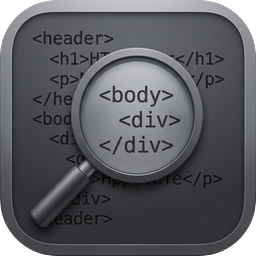
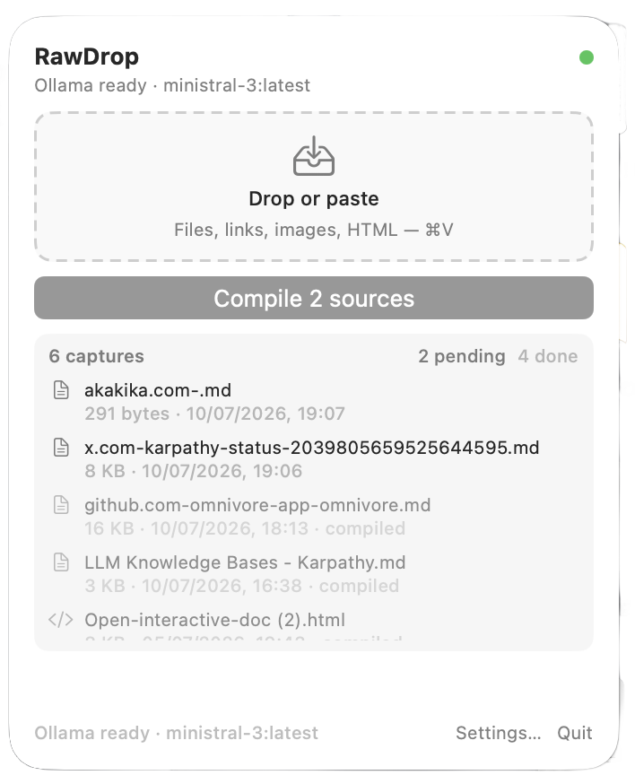
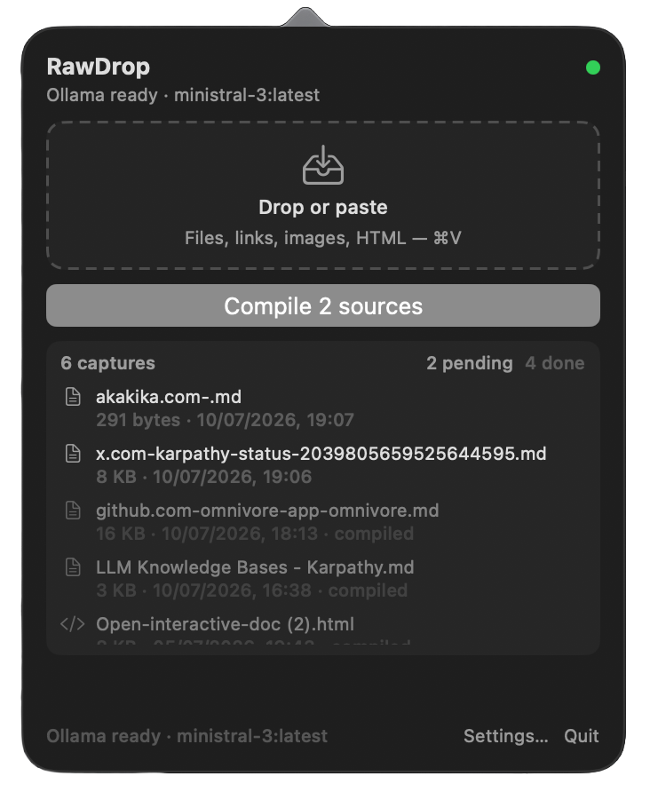

<div align="center">



# RawDrop

**Drop anything into your knowledge vault. Compile it into a wiki with one button.**

A macOS menu bar app that feeds and compiles a personal, [Karpathy-style LLM knowledge base](https://x.com/karpathy/status/2039805659525644595) living in Obsidian.

[](https://github.com/aka-kika/rawdrop/releases/latest)
[](https://github.com/aka-kika/rawdrop/releases)
[](#requirements)
[](#building-from-source)
[](./LICENSE)

**[Download](https://github.com/aka-kika/rawdrop/releases/latest)** · signed &amp; notarized · universal (Apple Silicon + Intel)

<br />


&nbsp;


<em>Light and dark — the capture list sits under Compile; pending sources at full opacity, compiled ones dimmed.</em>

</div>

---

## Why

Andrej Karpathy described a simple loop: pour raw sources in, let an LLM compile them into a wiki, and let the wiki compound over time. The hard part is the capture-and-compile surface — somewhere frictionless to drop things, and one button that turns them into notes.

RawDrop is that surface. It lives in your menu bar, copies whatever you drop into your Obsidian vault's `raw/` folder, and — on demand — compiles the new material into linked concept articles under `wiki/`. Everything stays local unless you point it at Ollama Cloud. No account, no telemetry, no lock-in — the output is plain Markdown in a folder you already own.

## How it works

Two jobs, nothing more.

**1 — Capture (drop / paste).** Files, HTML, images, and URLs are **copied** into `Knowledge/raw/` — never moved, never overwritten (collisions become ` 2`, ` 3`, …). While the popover is open, **⌘V** captures the clipboard. The list under Compile shows pending sources first, then already-compiled items (dimmed).

**2 — Compile.** One button. For every raw file not yet processed (tracked by content hash): chunk → summarize via Ollama `/api/chat` → write concept articles under `Knowledge/wiki/` with origin frontmatter → update `wiki/_index.md`. Process state lives in `~/Library/Application Support/RawDrop/` — **not** in your vault.

## Features

- **Menu bar popover** — drop zone, ⌘V capture, one Compile button, capture list, Settings / Quit. No Dock icon.
- **Local or cloud Ollama** — default `http://localhost:11434`, or Ollama Cloud with an API key stored in the macOS Keychain.
- **Smart model picker** — recommended models ranked from what you have installed, plus a connectivity test.
- **Broad capture** — HTML extraction, PDF text (PDFKit), image paste as PNG, URL fetch → Markdown.
- **Provenance + safe recompile** — every article carries lean origin frontmatter; hybrid recompile preserves your `## Human` and `<!-- rawdrop:protected -->` edits.
- **Native comforts** — System / Light / Dark theme, Open at Login, and no App Sandbox surprises (writes only where you tell it).

Full inventory in **[FEATURES.md](./FEATURES.md)**.

## Install

Download **[RawDrop 0.3.8 (.dmg)](https://github.com/aka-kika/rawdrop/releases/latest)**, open it, and drag **RawDrop** to **Applications**. Launch it — it appears in the menu bar (no Dock icon).

The app is a **universal binary** (Apple Silicon + Intel), **signed and notarized by Apple**, so it opens with no Gatekeeper warning.

## Usage

1. Click the menu bar icon, open **Settings…**, and set **Knowledge root** to a folder that has (or will have) `raw/`, `wiki/`, and `outputs/`.
2. Drop or paste (**⌘V**) a file, link, or image onto the popover — it lands in `raw/`.
3. Press **Compile**. New sources become linked articles in `wiki/`.

Make sure [Ollama](https://ollama.com) is running (or Cloud is configured) before the first Compile.

## Requirements

- **macOS 14+** (Sonoma or newer)
- **[Ollama](https://ollama.com)** — local install or an Ollama Cloud API key — required only for the Compile step
- An Obsidian vault (or any folder) to hold `raw/` and `wiki/`

## Building from source

```bash
git clone https://github.com/aka-kika/rawdrop.git
cd rawdrop
xcodegen generate
xcodebuild -scheme RawDrop -configuration Debug -derivedDataPath ./DerivedData build
open ./DerivedData/Build/Products/Debug/RawDrop.app
```

Or open `RawDrop.xcodeproj` in Xcode and Run. Needs **Xcode 15+** and **[XcodeGen](https://github.com/yonaskolb/XcodeGen)**. Full walkthrough: **[docs/environment.md](./docs/environment.md)**.

## Vault law

The rules RawDrop plays by, so it never surprises your notes:

- Writes only under `Knowledge/raw/` (on drop), `Knowledge/wiki/`, and optionally `Knowledge/outputs/`.
- Never edits or deletes anything in `raw/` after it lands.
- Wiki articles use lean YAML (`type`, `date`, `status`, `tags`, `origin`, `sources` as `raw/…` paths, `compiled`), plain text, and `[[wikilinks]]`. URLs live in a `## Sources` footer; the recompile-safety hash stays internal (Application Support), not in your frontmatter.
- Hand-edit under `## Human` or `<!-- rawdrop:protected -->` and recompile will leave it alone.
- No cloud LLM unless you explicitly configure Ollama Cloud + API key.

## Defaults

| Setting | Default |
|---|---|
| Knowledge root | `~/Documents/Knowledge` (change in Settings) |
| Ollama base URL | `http://localhost:11434` |
| Model | `ministral-3:latest` (change in Settings) |
| Theme | System |
| Open at Login | Off (Settings → General) |
| Cloud | `https://ollama.com` + Keychain API key |

## Documentation

| Doc | Purpose |
|---|---|
| [FEATURES.md](./FEATURES.md) | Feature inventory |
| [ARCHITECTURE.md](./ARCHITECTURE.md) | Layout and data flow |
| [CHANGELOG.md](./CHANGELOG.md) | What shipped |
| [DECISIONS.md](./DECISIONS.md) | Why we chose X over Y |
| [docs/environment.md](./docs/environment.md) | Dev setup |
| [docs/privacy.md](./docs/privacy.md) | Privacy &amp; permissions |
| [docs/roadmap.md](./docs/roadmap.md) | Now / Next / Later |
| [docs/support.md](./docs/support.md) | FAQ &amp; troubleshooting |
| [SECURITY.md](./SECURITY.md) | Secrets and network rules |
| [CONTRIBUTING.md](./CONTRIBUTING.md) | How to contribute |

## Contributing

Issues and pull requests are welcome — start with **[CONTRIBUTING.md](./CONTRIBUTING.md)**, and see **[SECURITY.md](./SECURITY.md)** for reporting anything sensitive.

## License

**[MIT](./LICENSE)** — free to use, modify, and share.

<div align="center"><sub>Built by <a href="https://github.com/aka-kika">aka-kika</a>.</sub></div>
